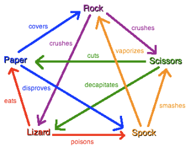

# Rock, Paper, Scissors, Lizard, Spock

Create an application that will allow the user to play the compute in a game of rock, paper, scissors, lizard, Spock. Which follows the rules below.

Write a basic menu game with the following rules:

1. Start new game (Reset):-> Displays a message to say a new game has started.
2. Computer go:->Display a message to inform the user that the computer has selected a state, Note do not display the computers selection at this point.
3. Users go:-> Allow the user to select a state.
4. Display winner:-> Display the computers and users’ selection and the winner.
5. Display scores:-> Display the number of wins for the user and the computer, and the overall winner.
6. Exit – stop running the program.

---
